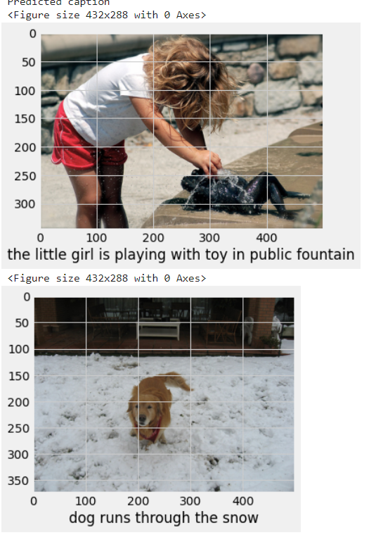

# Image Captioning Model using Deep learning

Note : Kindly Check out my image captioning web app created using streamlit 
and hosted on this webserver --> https://share.streamlit.io/mouleshm1710/image-captioning/main/cap_app.py

In this innovative project, I developed an Image Captioning System leveraging a Convolutional Neural Network (CNN) integrated with a Recurrent Neural Network (RNN). The model was trained on a dataset of images and corresponding captions to automatically generate descriptive captions for new images. Key highlights include:

Model Architecture: Implemented a hybrid CNN-RNN model in Keras, where the CNN extracts visual features and the RNN generates contextually relevant captions.

Performance Measurement: Used the BLEU score to evaluate the quality of generated captions, measuring similarity to reference captions for accuracy in producing human-like descriptions.

Text Vectorization: Employed GloVe with 200-dimensional vectors for effective word vectorization, enhancing semantic understanding and caption quality.

Data Pipeline: Developed a seamless data pipeline to process uploaded images efficiently, ensuring high-quality caption generation.

User Interface: Created a user-friendly interface with Streamlit, allowing users to upload images and receive real-time captions.

Deployment: Hosted the model on Streamlit Cloud, enabling direct user interaction and showcasing my ability to bridge machine learning with practical applications.

This project solidified my expertise in deep learning and machine learning deployment, positioning me as a strong candidate in data science

### Predictions Screenshot:

